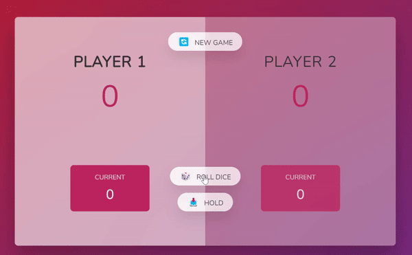

# Pig Game! Get to 100!

Tiny adorable dice game for two! Use your luck and strategy to win!

## Installation

```
git clone git@github.com:iKayden/pig_game.git
```

<hr>
Roll the dice while you can to gather the current score, stay away from die 1 because it will restart your current score and switch to another player, instead just hold your score and pass move to the other player. Get to 100 and WIN!

<br>

### Gameplay example with only 10 points to win

#### In the game it will be 100 (can be changed on line 81 in script.js)

<br>


